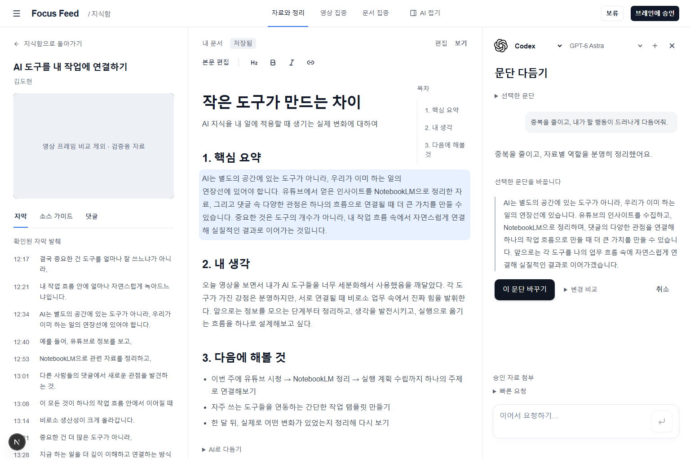
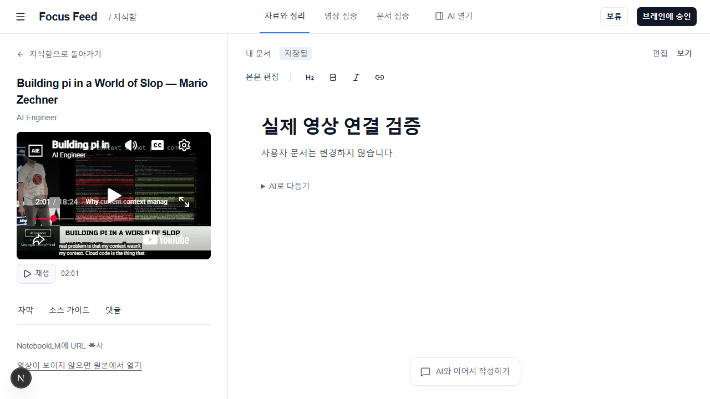

# 영상에서 내 문서까지 이어지는 작업실

지식함에서 자료를 열면 영상·근거, 편집 문서, 대화를 함께 볼 수 있다. 영상 집중과 문서 집중, 칸 너비 조절, 대화 접기, 선택 문단 수정 제안·적용·되돌리기를 같은 문서에 연결했다. 대화는 사용자가 선택한 로컬 실행 도구와 모델에 연결한다.

작업실 자체가 원격 main에 없었으므로 화면을 작동시키는 기반도 함께 포함한다. 초안 조회·버전 충돌 검사·저장·승인, 승인 자료 첨부, 승인 후 별도 수정안, 승인 버전 검증, 활용 메모와 검색, 로그인 복귀, 로컬 실행·상태 확인이 해당한다. 원본과 승인본을 자동으로 덮어쓰지 않는다. 기존 요금제·팀 제거, 문서 보관 이동과 운영 규칙 정리는 이 변경에서 제외했다.

## 영상 조작

영상 아래의 재생·일시정지 버튼은 준비된 YouTube IFrame API를 사용한다. 화면 크기가 달라진 직후에도 앱 버튼으로 조작하고 실제 상태 이벤트로 표시를 갱신한다. 사용자가 누르기 전에는 재생 요청을 보내지 않는다. 오류·준비 시간 초과에는 재시도와 원본 열기를 제공하며 문서와 미전송 채팅을 보존한다.

원래 iframe 내부 버튼의 전환 직후 클릭 문제 자체를 수정한 것은 아니다. 새 앱 버튼으로 고정 대기 없이 재생·시점 이동·일시정지를 검증했다. Codex 26.903.9818.0의 일반 탐색에는 로컬 페이지에서 외부 iframe 요청을 차단하는 조건이 있어 내장 창의 삽입 재생은 별개다. 호스트 정책은 변경하지 않았다. 일반 브라우저의 작업실 또는 YouTube 원본 탭을 사용한다.

## 실행과 데이터

`npm ci` 후 `npm run dev`로 앱을, `npm run knowledge:agent`로 대화를 실행한다. Windows에서 기존 검색 도구까지 연결하려면 [로컬 실행 안내](LOCAL_RUNTIME.md)를 따른다. 연결되지 않은 로컬 도구나 저장 경로는 사용 불가 상태로 표시한다.

SQL 원본은 `docs/supabase-migrations/025_knowledge_studio_approval.sql`과 `supabase/migrations/20260911165300_knowledge_amendments_storage.sql`이다. 파일을 커밋하는 작업은 운영 DB에 migration을 적용하는 작업과 다르다. 해당 RPC/테이블이 없는 환경은 별도 적용·권한 검증이 필요하다. 이 출시 작업에서 운영 DB, Brain 승인 파일, 검색 색인을 변경하지 않는다.

## 검증 근거

원본 작업 폴더에서 전체 verify:focus-feed가 통과했다. 단위 테스트 519개 통과·1개 건너뜀, 타입·빌드·시크릿·VHK 검사 통과, 기존 lint 경고 4개다. 신규 작업실 조작과 영상 실패 복구·실제 재생 E2E 4개도 통과했다.

실제 영상 검사는 job만 fixture로 제공하며 YouTube iframe/API/미디어는 실제 서버에 연결한다. 보기 전환 직후 앱 버튼 클릭부터 재생 시간 증가, 02:01 탐색, 메모 시점 연결, 화면 전환 중 위치 보존, 일시정지를 확인한다. 고정 1.5초 대기나 키보드 대체를 사용하지 않는다. 외부 영상 검사는 FOCUS_FEED_LIVE_VIDEO=1로 명시 실행하며 일반 CI는 모의 플레이어로 회귀를 확인한다.

통합 브랜치의 최종 검사와 독립 검토 결과는 PR에 기록한다. 원본 폴더에서의 검사만으로 다른 통합 결과가 검증됐다고 보지 않는다.
